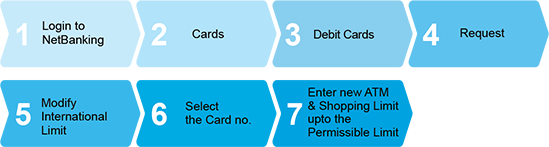

# test
   
You can enhance your limit on your Debit Card in a few simple steps using ADFC NetBanking.
<ol>
    <li>  Login to the netbanking. 
    <li>  Go to cards > Debit Cards.
    <li>  From the Request tab, click Modify International Limit. 
    <li>  Select Card Number, and update the new card limit. 
      <b> Note </b>:
      You can update the card limit only upto the permissible limit.    
</ol>

Reference
<a href= "https://www.youtube.com/watch?v=tBKiEDRd4qk"> Click here </a> to watch the demo.   or  
Follow the below steps to update the limit. 
